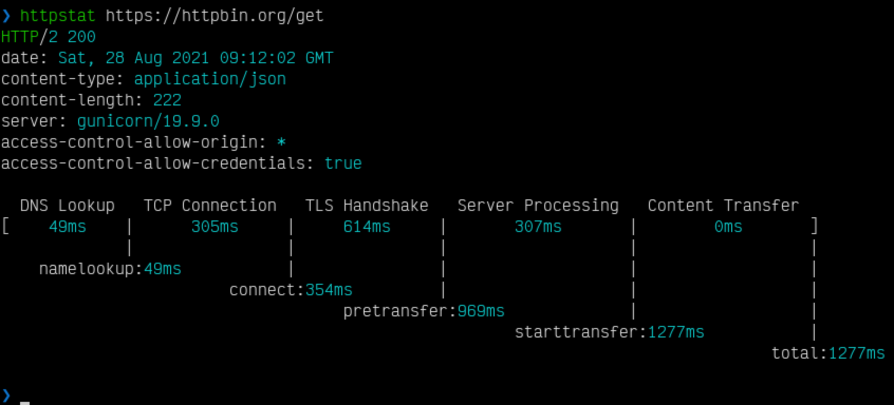

# httpstat



Rust clone of https://github.com/reorx/httpstat.

## Installation

```
$ cargo install --git https://github.com/johnnynotsolucky/rust-httpstat
```

## Usage
```
$ httpstat https://example.com/
$ httpstat --help

USAGE:
    httpstat [FLAGS] [OPTIONS] <url>

FLAGS:
    -h, --help         Prints help information
    -k, --insecure     Allow insecure server connections when using SSL
    -L, --location     Follow redirects
    -o, --save-body
    -V, --version      Prints version information
    -v, --verbose      Verbose output

OPTIONS:
    -X, --request <command>           Specify request command to use [default: GET]
    -d, --data <data>                 HTTP POST data
    -H, --header <headers>...         Pass custom header(s) to server
        --connect-timeout <millis>    <seconds> Maximum time allowed for connection

ARGS:
    <url>    URL to work with
```

## TODO

- [ ] Enable proxies
- [ ] Custom certificates

## Contributing

TODO
